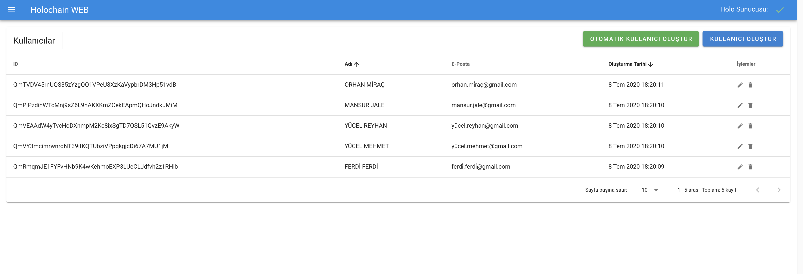
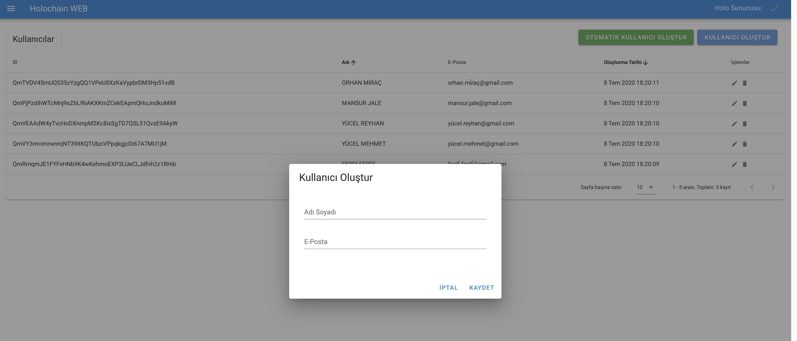
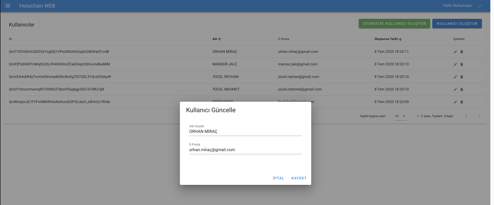

# Holochain Panel Arayüzü

## Uygulama Hakkında
* Uygulama servisi holochain ile yazıldı.
* Vue & Vuetify kullanılarak hazırlandı.


## Uygulamayı Paketlerini Yükle
```console
yarn install
```

### Uygulamayı Başlat (developer modunda)
```console
yarn serve
```

### Uygulamayı Yayınla
```console
yarn build
```

### [Uygulama Servisine Git](https://github.com/bayramlcm/holochain-panel)

## Ekran Görüntüleri

### Kullanıcı Listele


### Kullanıcı Oluştur


### Kullanıcı Güncelle

